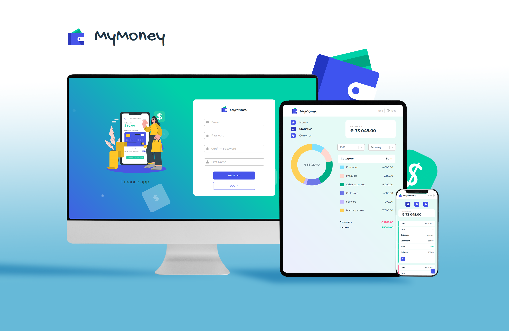

# MyMoney

## 

---

## Application purpose:

The MyMoney is an application to track your income & expenses to help you to
control your money easily and fast. Also, you can monitor the money exchange
course inside the app and be always ready for cryptocurrency changes.

The MyMoney application presents the USD and EUR currency rates and the most
famous five crypto coins like Bitcoin, Ethereum, BNB, etc.

---

## Functionality:

When you first open the MyMoney app we redirected you to the registration page
or If you already have an account - you can log in to your private account.

Inside the app, you have three different pages in mobile and tablet versions:
the Home page, the Statistics page, and the Currency page. In the desktop
version, you have only two pages: the Currency page information is located on
the Home page.

All your transactions are located on the Home page inside the special table. You
can add a transaction by clicking the button below the Home page.

When you do that, you can see the special modal window where you can choose the
type of your transaction, transaction category, specify amount, date and add a
comment. When you add all of your information about the transaction and click
the Add button - the data will be updated on the Home and the Statistic pages.
Also, you can delete a transaction after successful adding if you notice some
mistakes.

On the Statistics page, we present all your expenses using a doughnut diagram
sorting your transactions by categories. The Statistic page displays categories
summary during the chosen period. Besides, you can change the period of your
visible transactions using dropdown lists.

---

## Technology stack:

The MyMoney app is the React app, where we as developers tried to use all our
knowledge from JavaScript Bootcamp.

For page navigation, we work with React Router and Higher order component that
helps us with user token checking. We implement Redux Toolkit for centralizing
our application's state and enabling powerful logic capabilities. We have
choosen Redux Thunk and Axios for most of all async\await operations.

We use styled-components for styling our app. For increasing user experience we
added a spinner that informs the user that data loading is in progress. We
created all forms inside the app by using Formik and yup libraries.

---

We hope you will enjoy the MyMoney application!

---

Have fun!
